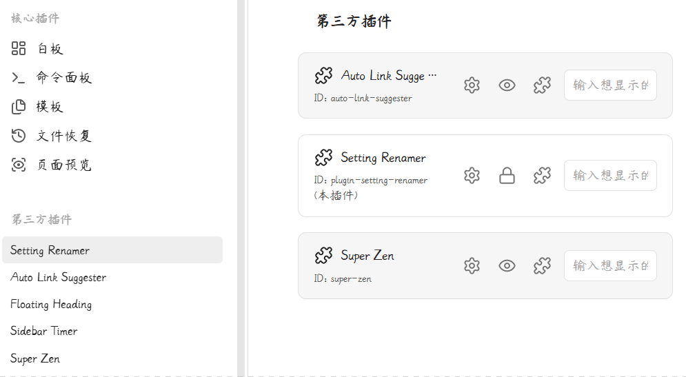
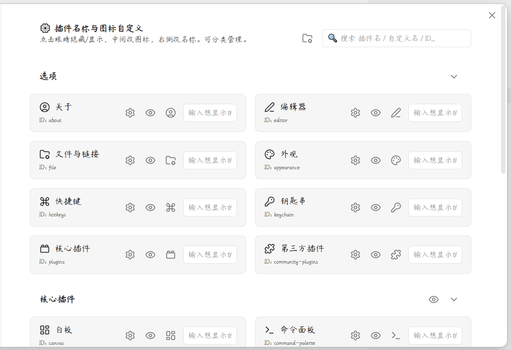

# ✦ 设置选项自定义/插件更名器 ✦

我在小红书发布了许多obsidian的教程和插件开发进度，你的关注就是对我最大的支持

自由重命名、替换图标、隐藏设置面板，让Obsidian设置侧边栏焕然一新。

  

  

[简体中文](#简体中文) | [用法](#用法) | [English](#english) | [Usage](#usage)

---

## 简体中文

### 核心功能

#### 1. 选项卡自由重命名
自由更改 Obsidian 设置侧边栏内任何选项卡的名称，包括核心设置、核心插件和所有第三方社区插件。

#### 2. 侧边栏图标替换
支持将默认图标替换为上千款精美 Lucide 图标，内置模糊搜索弹窗实时查找预览。

#### 3. 隐藏不常用面板
彻底屏蔽极少配置的插件面板，大幅精简设置项，内置防锁死机制防止误操作。

#### 4. 极简网格管理面板
直观的响应式网格仪表盘，配备防抖实时搜索框，支持一键跳转到目标插件配置。

#### 5. 无痕安全卸载
基于 MutationObserver 动态监听，卸载时所有设置瞬间恢复至系统出厂状态。

***

## 用法

1. 安装插件后，在设置侧边栏找到 **Setting Renamer** 面板。
2. 在网格管理面板中，点击任意插件名称旁的编辑按钮进行重命名。
3. 点击图标区域可打开图标选择器，搜索并替换为喜欢的 Lucide 图标。
4. 使用隐藏开关可隐藏不需要的设置面板，保持侧边栏整洁。
5. 所有修改实时生效，卸载插件后自动恢复原状。

***

### 赞赏支持

🎁 如果觉得有用，请作者喝杯咖啡

 

  

***

### 安装方法

#### 方法一：社区插件安装（推荐）

待插件通过审核并上架社区市场后：
1. 打开 Obsidian **设置** > **社区插件** > **浏览**。
2. 搜索并选择 `Setting Renamer`。
3. 点击 **安装** 并选择 **启用**。

#### 方法二：手动安装

1. 前往 [Releases](https://github.com/hornatx/obsidian-plugin-renamer/releases) 页面下载最新的 `main.js` 和 `manifest.json` 文件。
2. 打开您的 Obsidian 库所在的本地文件夹。
3. 进入 `.obsidian/plugins/` 目录，并创建一个名为 `plugin-setting-renamer` 的文件夹。
4. 将下载的两个文件放入该文件夹中。
5. 在 Obsidian **设置** > **社区插件** 中重新加载并开启该插件。

***

QQ 交流群：1094620986

---

## English

**Setting Renamer** — A highly elegant customization tool for Obsidian. It lets you declutter and beautify your Obsidian Settings sidebar by custom-naming tabs, swapping Lucide icons, and hiding unused setting panels with a sleek dashboard.

***

### Features

#### 1. Dynamic Renaming
Custom-rename any tab in your Obsidian Settings sidebar, including Core Settings, Core Plugins, and all Community Plugins.

#### 2. Swap Tab Icons
Replace default icons with any icon from Obsidian's native library of over 1,000 Lucide icons. Built-in fuzzy-search modal makes searching and previewing easy.

#### 3. Hide Unwanted Panels
Hide unused or rarely configured plugin setting tabs to keep your settings workspace clean. Includes fail-safe lock protection.

#### 4. Interactive Control Panel
Beautiful, responsive grid-layout setting tab with live debounced search bar and one-click jump to plugin setup panel.

#### 5. Safe & Revertible
Uses MutationObserver and live-patching to safely hook into settings. Automatically restores all native settings when plugin is turned off.

***

## Usage

1. After installing the plugin, find the **Setting Renamer** panel in settings sidebar.
2. In the grid management panel, click the edit button next to any plugin name to rename it.
3. Click the icon area to open the icon picker, search and replace with your favorite Lucide icon.
4. Use the hide toggle to hide unwanted setting panels and keep the sidebar clean.
5. All changes take effect in real-time and automatically restore when the plugin is uninstalled.

***

### Installation

#### Method 1: Community Plugins (Recommended)

Once the plugin is reviewed and listed on the community marketplace:
1. Open Obsidian **Settings** > **Community plugins** > **Browse**.
2. Search for and select `Setting Renamer`.
3. Click **Install** and then **Enable**.

#### Method 2: Manual Installation

1. Go to the [Releases](https://github.com/hornatx/obsidian-plugin-renamer/releases) page to download the latest `main.js` and `manifest.json` files.
2. Open your Obsidian vault folder on your computer.
3. Navigate to the `.obsidian/plugins/` directory and create a folder named `plugin-setting-renamer`.
4. Place the downloaded files into this folder.
5. Reload and enable the plugin in Obsidian **Settings** > **Community plugins**.

***

QQ Group: 1094620986